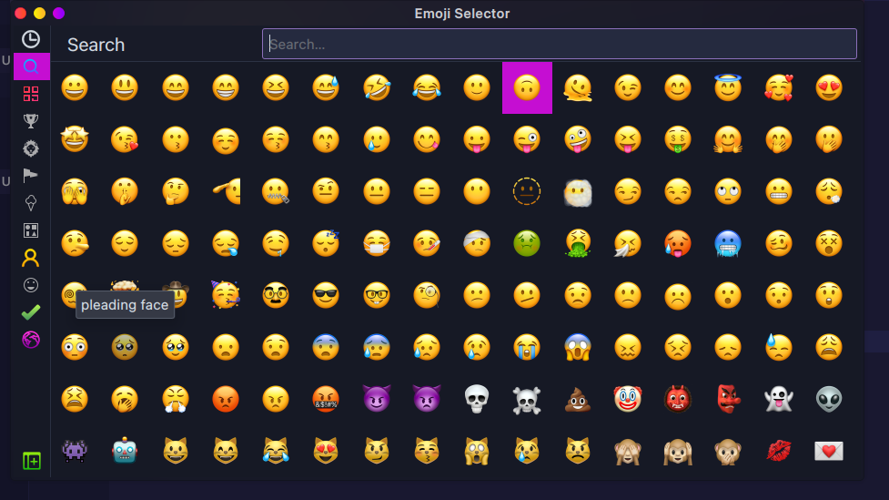

# IOS-emoji-for-linux

Based on latest 16.4 ios emojis

tested on Garuda linux 


## Disclaimer

The code provided is for educational purposes only. Apple is a trademark of Apple Inc., registered in the U.S. and other countries. 




## Installation
```sh
git clone https://github.com/Van-tesh/Apple-Emoji.git
cd Apple-Emoji
sudo ./install.sh 


```             
## Do not forget to rebuild font cache
```
fc-cache -f -v
```
Enjoy your new emojis
